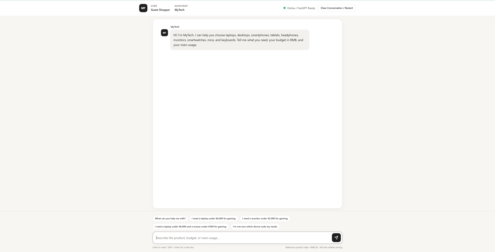
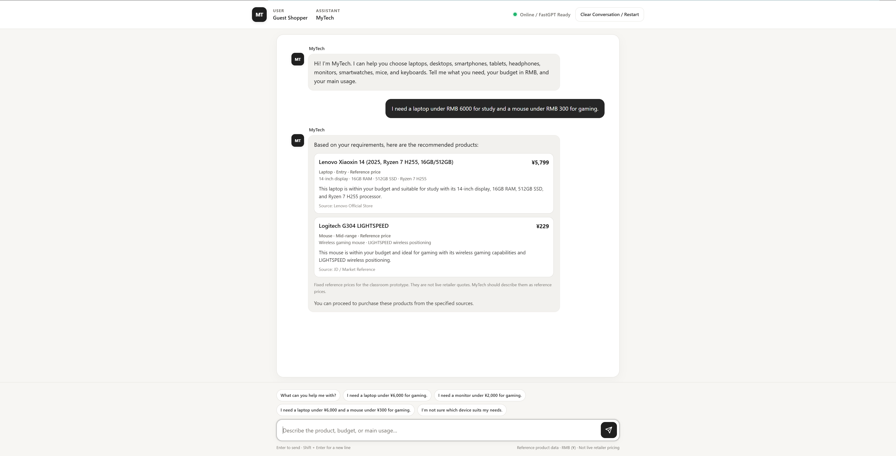

# MyTech v2 — Grounded RAG Product Recommendation Assistant

[](https://github.com/ych680/mytech-ai-assistant/actions/workflows/tests.yml)

MyTech v2 is an electronic product recommendation chatbot developed as a postgraduate AI coursework team project. Users describe a device, maximum budget, and main usage; the assistant retrieves reference product evidence, asks for missing requirements, and returns validated recommendations rather than relying on unrestricted model output.

The locally runnable prototype combines a **browser frontend**, a **Node.js backend**, and a **FastGPT RAG workflow**. It covers **9 product categories and 27 reference products**, with deterministic response validation and **16 automated tests**. These counts describe the project's scope, not recommendation accuracy or production reliability.

## Demo

[Watch on YouTube: MyTech v2 | RAG Product Recommendation Chatbot — Project Demo](https://youtu.be/9Jwxje5Aj6w)

This approximately 67-second demo shows multi-product recommendations, contextual follow-ups, multi-turn clarification, and hard-budget constraints with no-match handling.

### Chatbot Interface

Starter prompts, generation status, conversation restart, and product cards support the recommendation flow.



### Multi-product Recommendation

Each product request keeps its own category, budget, and usage requirements. For example:

> I need a laptop under RMB 6000 for study and a mouse under RMB 300 for gaming.



These screenshots show earlier local demonstrations; they do not capture every current feature. There is no public production deployment.

## Key Features

- **Grounded recommendations:** FastGPT retrieves product evidence from the MyTech knowledge base before recommendation generation.
- **Supported categories:** Laptop, Desktop, Smartphone, Tablet, Headphones, Monitor, Smartwatch, Mouse, and Keyboard.
- **Conversation handling:** Multi-turn clarification, separate requirements for multi-product requests, and contextual cheaper, more expensive, or alternative follow-ups.
- **Hard-budget enforcement:** Deterministic checks reject recommendations above the active maximum budget.
- **Structured responses:** JSON output is validated for product identity, category, exact reference price, source consistency, and response fields before card rendering.
- **Restart and safe errors:** Restart clears local conversation state and rotates the FastGPT `chatId`. Failed requests, timeouts, and unusable model output display an error without unvalidated product cards; invalid workflow recommendations use a fallback branch.
- **Failed request recovery:** “Edit and try again” restores the submitted message to the composer, resizes it, and focuses it for editing. It makes no request and does not alter conversation state. Existing drafts, including whitespace, are protected; another submission or Restart invalidates older recovery actions.

## System Architecture

```text
Browser Frontend → Node.js Backend → FastGPT Workflow
                                      ↓
                            State Extraction and Routing
                                      ↓
                            Knowledge Base Retrieval (RAG)
                                      ↓
                            Grounded Recommendation Generation
                                      ↓
                            Workflow Validation and Normalization
                                      ↓
Node.js Response Validation → Browser Validation → Product Card Rendering
```

The browser submits requests to the same-origin `/api/mytech` endpoint. The backend calls FastGPT with server-side credentials and a conversation `chatId`; FastGPT manages workflow conversation variables for follow-ups. Validation is applied at three points, with different responsibilities:

| Layer | Implemented checks |
|---|---|
| FastGPT workflow | Product identity, category and active-request consistency, exact price and source, hard budgets, duplicate categories, and follow-up constraints. |
| Node.js response helpers | JSON parsing and response shape, catalogue identity/category/price, source when supplied, active budgets, recognized usage tags, and selected unsupported live-price/availability claims. |
| Browser | Response shape and catalogue checks, active budget/usage constraints, contextual follow-up checks, and selected unsupported live-price/availability claims before rendering. |

Retrieval supplies evidence; validation checks defined rules against reference data. These checks do not establish that every generated explanation is correct.

The response contract contains `answer`, `recommendations[]`, `next_step`, and `clarification_needed`. See the [workflow documentation](workflow/README.md) for the full pipeline, routing branches, and JSON example.

### Knowledge and Local References

The [knowledge-base source](knowledge/MyTech_Product_Knowledge_v1.md) groups each product's name, category, reference price, usage, features, and source for FastGPT retrieval. The [local JSON catalogue](mytech_v1_product_dataset.json) supplies backend/browser validation data and card details; the workflow also contains a static validation catalogue.

The [system prompt file](mytech_v1_system_prompt.txt) is still loaded during server and browser initialization. Keep it and the JSON catalogue alongside the application files. The published FastGPT workflow contains the model-node prompts used for generation.

## Testing & CI

The project has **16 automated tests**, using Node.js built-ins without a testing framework or additional packages:

| Suite | Tests | Coverage |
|---|---:|---|
| [Response tests](tests/response.test.mjs) | 8 | FastGPT message extraction, JSON parsing/error codes, optional-source normalization, field validation, valid no-result/clarification responses, catalogue mismatches, budget boundaries, and recognized usage constraints. |
| [Frontend recovery tests](tests/frontend-recovery.test.mjs) | 8 | Recovery creation, exact submitted-text restoration, resize/focus, no extra request or state changes on restore, draft/generation protection, stale-action invalidation, restart-aborted/late failures, and subsequent submission through validation. |

Run both suites locally from the repository root:

```bash
node --test tests/response.test.mjs tests/frontend-recovery.test.mjs
```

The frontend suite executes the actual inline script in `node:vm`, skipping automatic initialization and using minimal DOM stubs and a fake model adapter. Neither suite requires credentials, a running server, or real FastGPT calls.

[GitHub Actions](.github/workflows/tests.yml) runs on pull requests and pushes to `main`, using Node.js 24. It checks the syntax of `mytech_v2_server.mjs` and `mytech_response.mjs`, then runs both suites.

These tests cover defined response-helper and recovery behavior. They do not prove live FastGPT availability, measure real-world recommendation accuracy, verify browser layout, or replace full end-to-end testing with a live model.

## My Contribution

MyTech is a postgraduate team coursework project. As the repository maintainer, I led most of the core implementation: product and workflow design, FastGPT workflow configuration and API integration, frontend/backend integration, testing and troubleshooting, automated tests and GitHub CI improvements, and ongoing repository maintenance. Other team members participated in testing, reproducing workflow configurations, and related project activities.

## Setup and Reproducibility

Prerequisites: Node.js **20.6 or newer** for the documented `--env-file` command, and access to a FastGPT deployment with suitable models and a knowledge base. CI uses Node.js 24. The local application uses Node.js built-ins; no package installation is required.

1. **Import the workflow.** Import [workflow/mytech-fastgpt-workflow.json](workflow/mytech-fastgpt-workflow.json) into your FastGPT deployment.
2. **Select the models.** The export retains these intended model names, but its account-specific `modelId` values are empty:

   | Node | Intended model |
   |---|---|
   | State Extraction | `glm-5.3-flash` |
   | Clarification Assistant | `glm-5.3-flash` |
   | Recommendation Assistant | `deepseek-v4.1-flash` |

   Re-select each model after import. Availability depends on the deployment; if a listed model is unavailable, choose a compatible model and verify workflow behavior in that environment.
3. **Import and bind the knowledge base.** Create a FastGPT knowledge base, import [knowledge/MyTech_Product_Knowledge_v1.md](knowledge/MyTech_Product_Knowledge_v1.md), and bind it to **Knowledge Retrieval**. The export intentionally has no dataset binding; its dataset-description ID is `REPLACE_AFTER_IMPORT`. Save and publish the configured workflow.
4. **Configure the local environment.** From the repository root, copy the placeholder template:

   ```bash
   cp .env.example .env
   ```

   Set `FASTGPT_API_KEY`, `FASTGPT_API_URL`, and `FASTGPT_APP_ID` for your published workflow. `PORT` defaults to `8787`. The backend accepts HTTPS endpoints, or HTTP endpoints on localhost/loopback. The template's example endpoint is not a working deployment.
5. **Run locally:**

   ```bash
   node --env-file=.env mytech_v2_server.mjs
   ```

6. Open [http://127.0.0.1:8787](http://127.0.0.1:8787), or the port configured in `.env`. The server binds to `127.0.0.1`.

The portable export omits API credentials, account-specific model IDs, and concrete knowledge-base IDs. Keep credentials server-side and never commit real environment files. [.gitignore](.gitignore) excludes local `.env` files and backups; [.env.example](.env.example) contains placeholders only.

## Repository Guide

| File or directory | Purpose |
|---|---|
| [MyTech_Chatbot_v2.html](MyTech_Chatbot_v2.html) | Browser UI, local conversation constraints, validation, card rendering, and failed request recovery. |
| [mytech_v2_server.mjs](mytech_v2_server.mjs) | Local HTTP server and server-side FastGPT integration. |
| [mytech_response.mjs](mytech_response.mjs) | Response parsing, normalization, and deterministic validation helpers. |
| [workflow/](workflow/README.md) | Portable workflow export, architecture documentation, and workflow screenshots. |
| [knowledge/MyTech_Product_Knowledge_v1.md](knowledge/MyTech_Product_Knowledge_v1.md) | Knowledge-base import source. |
| [mytech_v1_product_dataset.json](mytech_v1_product_dataset.json) | Local validation catalogue and card data. |
| [mytech_v1_system_prompt.txt](mytech_v1_system_prompt.txt) | Required runtime/reference prompt file. |
| [tests/response.test.mjs](tests/response.test.mjs), [tests/frontend-recovery.test.mjs](tests/frontend-recovery.test.mjs) | Dependency-free automated tests. |
| [.github/workflows/tests.yml](.github/workflows/tests.yml) | Syntax checks and automated test CI. |
| [docs/screenshots/](docs/screenshots/) | Local demonstration screenshots. |

## Prototype Limitations

- Prices are fixed RMB reference values; live retailer pricing, inventory, and purchasing are not supported.
- The classroom catalogue contains only 27 products. Recommendations are limited by that dataset and the configured retrieval/model behavior.
- Running recommendations requires a configured external FastGPT workflow, available models, and the imported knowledge base. The “FastGPT Ready” status checks configuration, not live connectivity.
- The project is a local coursework/portfolio prototype, with no public production deployment. Public hosting would require authentication, rate limiting, monitoring, and appropriate secret management and operational controls.
