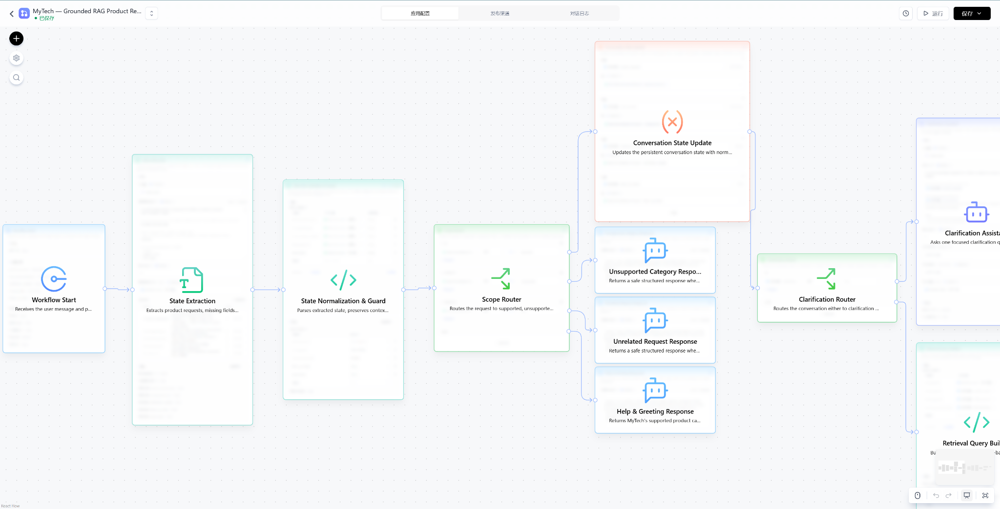
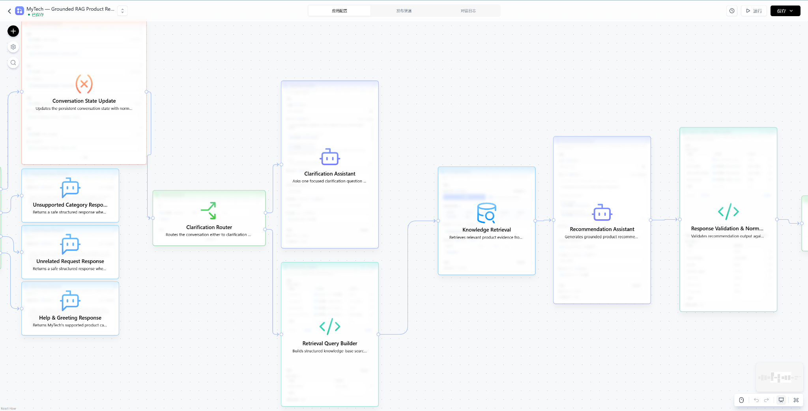
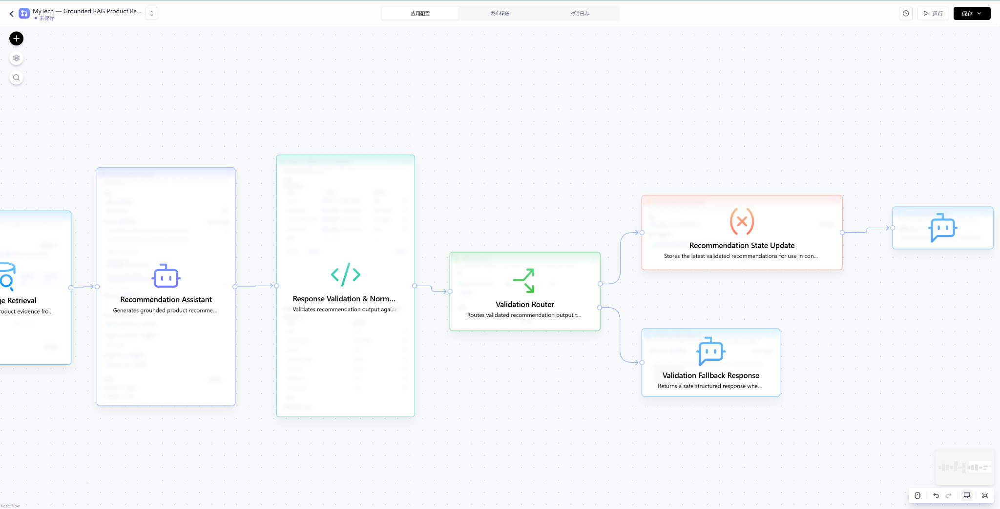

# MyTech FastGPT Workflow

This folder contains the FastGPT workflow configuration used by MyTech, a grounded RAG-based electronic product recommendation assistant.

## Workflow Architecture

The workflow combines LLM-based state extraction with deterministic validation and knowledge-base retrieval.

### Main Pipeline

1. **Workflow Start**
   - Receives the user's message.

2. **State Extraction**
   - Extracts product category, budget, main usage, follow-up intent, and request scope.

3. **State Normalization & Guard**
   - Normalizes extracted state.
   - Preserves contextual follow-up requests.
   - Applies deterministic category validation.

4. **Scope Router**
   - Routes supported, unsupported, help, and unrelated requests.

5. **Clarification Router**
   - Requests missing information when category, budget, or main usage is incomplete.

6. **Retrieval Query Builder**
   - Builds state-aware retrieval queries using the active request, previous recommendations, and follow-up intent.

7. **Knowledge Retrieval**
   - Retrieves relevant product evidence from the MyTech knowledge base.

8. **Recommendation Assistant**
   - Generates grounded product recommendations using retrieved evidence and the active conversation state.

9. **Response Validation & Normalization**
   - Validates product identity, category, price, hard-budget constraints, source consistency, and follow-up behavior.
   - Produces the normalized JSON response consumed by the frontend.

10. **Validation Router**
    - Sends valid recommendations to the final response path.
    - Routes invalid outputs to a safe fallback response.

11. **Recommendation State Update**
    - Stores validated recommendations for contextual follow-up requests such as cheaper, more expensive, or alternative options.

## Workflow Screenshots

### State Extraction and Scope Routing

### Clarification and RAG Recommendation Pipeline

### Validation and Response Flow

## Workflow Configuration

The exported FastGPT workflow is available here:

`mytech-fastgpt-workflow.json`

The workflow export includes the node configuration, prompts, routing logic, JavaScript validation logic, state variables, and workflow connections.

## Knowledge Base Setup

The FastGPT export does not package the linked knowledge base itself.

After importing the workflow:

1. Create a FastGPT knowledge base.
2. Import `../knowledge/MyTech_Product_Knowledge_v1.md`.
3. Open the **Knowledge Retrieval** node.
4. Bind the newly created knowledge base to that node.
5. Save and publish the workflow.

The provided knowledge file contains the product reference data used by MyTech.

## Model Configuration

The portfolio workflow uses **Qwen-turbo** for:

- state extraction
- clarification
- grounded recommendation generation

Model availability may depend on the FastGPT deployment being used.

## Important Notes

- Product prices are fixed reference prices for this prototype and are not live retailer prices.
- The user's budget is treated as a hard maximum.
- Recommendations must remain within the requested product category.
- Product facts must be grounded in retrieved knowledge-base evidence.
- The validation layer rejects inconsistent, over-budget, or unsupported recommendations.
- API credentials are not included in the exported workflow.

## Portfolio Export Sanitization

Deployment-specific identifiers have been intentionally removed from the public portfolio export.

After importing the workflow into your own FastGPT deployment:

1. Re-select a compatible LLM (for example, Qwen-turbo) in the model nodes.
2. Create or import your own knowledge base.
3. Bind that knowledge base to the **Knowledge Retrieval** node.
4. Save and publish the workflow in your own environment.

No API credentials, private deployment URLs, application IDs, or original knowledge-base identifiers are included in this portfolio export.
